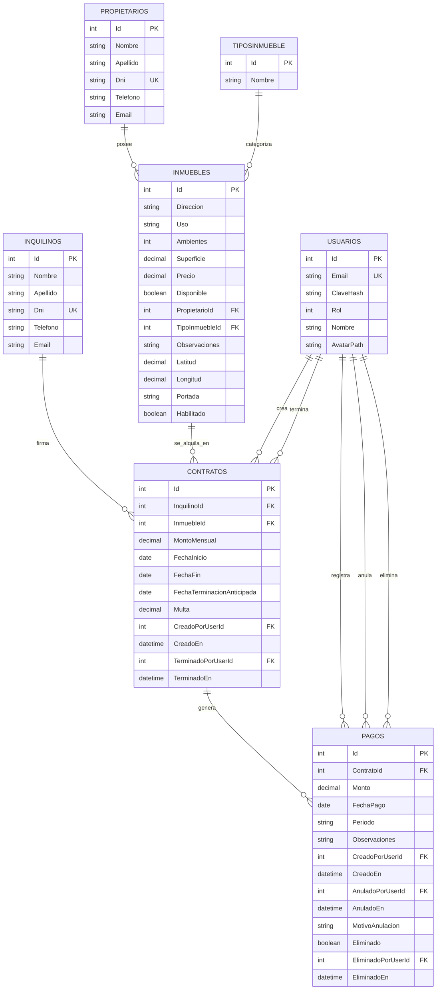

# Diagrama Entidad-Relación - Sistema Inmobiliaria

## Descripción
Este diagrama muestra la estructura de la base de datos del sistema inmobiliaria, incluyendo todas las entidades, sus atributos y las relaciones entre ellas.

## Diagrama ER



## Descripción de Entidades

### USUARIOS
- **Propósito**: Gestionar usuarios del sistema (administradores y empleados)
- **Atributos clave**:
  - `Id`: Identificador único
  - `Email`: Email único para login
  - `ClaveHash`: Contraseña encriptada
  - `Rol`: Tipo de usuario (1=Administrador, 2=Empleado)

### PROPIETARIOS
- **Propósito**: Almacenar información de los propietarios de inmuebles
- **Atributos clave**:
  - `Id`: Identificador único
  - `Dni`: Documento único
  - `Nombre`, `Apellido`: Datos personales

### INQUILINOS
- **Propósito**: Almacenar información de los inquilinos
- **Atributos clave**:
  - `Id`: Identificador único
  - `Dni`: Documento único
  - `Nombre`, `Apellido`: Datos personales

### TIPOSINMUEBLE
- **Propósito**: Categorizar los tipos de inmuebles
- **Atributos clave**:
  - `Id`: Identificador único
  - `Nombre`: Tipo (Casa, Departamento, Local, Oficina)

### INMUEBLES
- **Propósito**: Almacenar información de los inmuebles
- **Atributos clave**:
  - `Id`: Identificador único
  - `Direccion`: Ubicación del inmueble
  - `Precio`: Precio de alquiler
  - `Disponible`: Estado de disponibilidad
  - `PropietarioId`: Relación con propietario
  - `TipoInmuebleId`: Relación con tipo

### CONTRATOS
- **Propósito**: Gestionar contratos de alquiler
- **Atributos clave**:
  - `Id`: Identificador único
  - `MontoMensual`: Monto del alquiler
  - `FechaInicio`, `FechaFin`: Período del contrato
  - `FechaTerminacionAnticipada`: Para contratos terminados antes de tiempo
  - `Multa`: Multa por terminación anticipada
  - **Auditoría**: `CreadoPorUserId`, `CreadoEn`, `TerminadoPorUserId`, `TerminadoEn`

### PAGOS
- **Propósito**: Registrar pagos de alquiler
- **Atributos clave**:
  - `Id`: Identificador único
  - `Monto`: Monto del pago
  - `FechaPago`: Fecha del pago
  - `Periodo`: Período pagado (YYYY-MM)
  - `Eliminado`: Soft delete
  - **Auditoría**: `CreadoPorUserId`, `CreadoEn`, `AnuladoPorUserId`, `AnuladoEn`, `EliminadoPorUserId`, `EliminadoEn`

## Relaciones Principales

1. **PROPIETARIOS → INMUEBLES**: Un propietario puede tener múltiples inmuebles
2. **TIPOSINMUEBLE → INMUEBLES**: Un tipo puede categorizar múltiples inmuebles
3. **INQUILINOS → CONTRATOS**: Un inquilino puede tener múltiples contratos
4. **INMUEBLES → CONTRATOS**: Un inmueble puede tener múltiples contratos (histórico)
5. **CONTRATOS → PAGOS**: Un contrato puede generar múltiples pagos
6. **USUARIOS → CONTRATOS**: Los usuarios crean y gestionan contratos
7. **USUARIOS → PAGOS**: Los usuarios registran, anulan y eliminan pagos

## Características del Diseño

### Auditoría Completa
- **Contratos**: Rastrea quién creó y terminó cada contrato
- **Pagos**: Rastrea quién creó, anuló y eliminó cada pago
- **Timestamps**: Fechas de creación, modificación y eliminación

### Soft Delete
- **Pagos**: Implementa eliminación lógica con `Eliminado` y `EliminadoEn`
- **Auditoría de eliminación**: `EliminadoPorUserId` y `EliminadoEn`

### Integridad Referencial
- **Foreign Keys**: Todas las relaciones tienen restricciones de integridad
- **Cascade Rules**: `ON DELETE RESTRICT` para prevenir eliminaciones accidentales

### Flexibilidad
- **Contratos**: Soporte para terminación anticipada con multas
- **Pagos**: Soporte para anulación y eliminación lógica
- **Inmuebles**: Estados de disponibilidad y habilitación

## Índices Recomendados

```sql
-- Índices para mejorar rendimiento
CREATE INDEX IX_Inmuebles_PropietarioId ON Inmuebles(PropietarioId);
CREATE INDEX IX_Inmuebles_TipoInmuebleId ON Inmuebles(TipoInmuebleId);
CREATE INDEX IX_Contratos_InquilinoId ON Contratos(InquilinoId);
CREATE INDEX IX_Contratos_InmuebleId ON Contratos(InmuebleId);
CREATE INDEX IX_Contratos_CreadoPorUserId ON Contratos(CreadoPorUserId);
CREATE INDEX IX_Pagos_ContratoId ON Pagos(ContratoId);
CREATE INDEX IX_Pagos_CreadoPorUserId ON Pagos(CreadoPorUserId);
```

## Consideraciones de Seguridad

1. **Encriptación**: Contraseñas encriptadas con BCrypt
2. **Auditoría**: Rastro completo de todas las operaciones
3. **Roles**: Sistema de roles para control de acceso
4. **Soft Delete**: Prevención de pérdida de datos
5. **Validaciones**: Restricciones de integridad en base de datos

